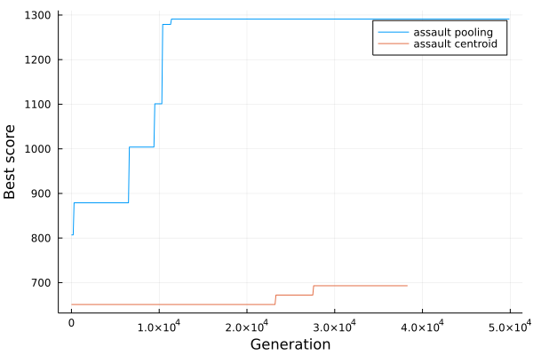
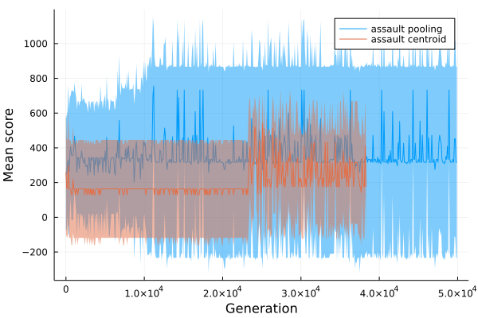
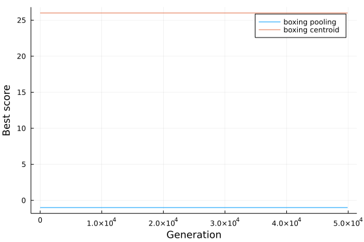
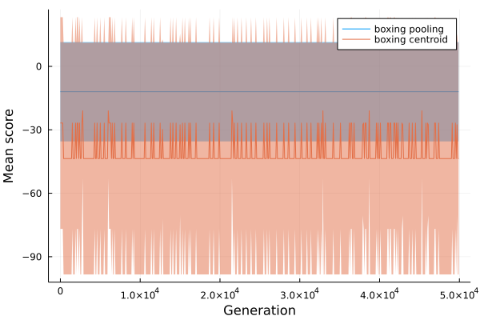
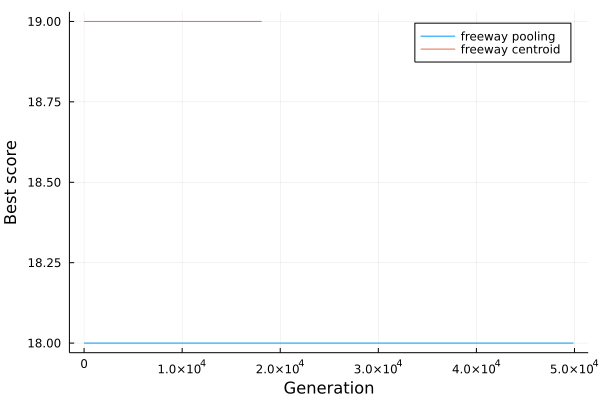
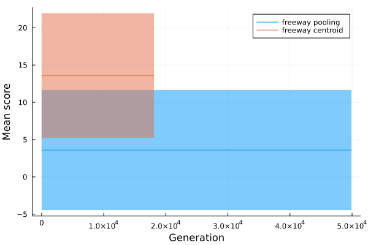
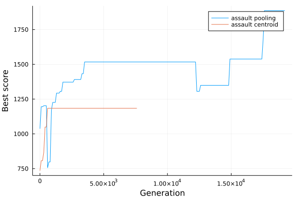
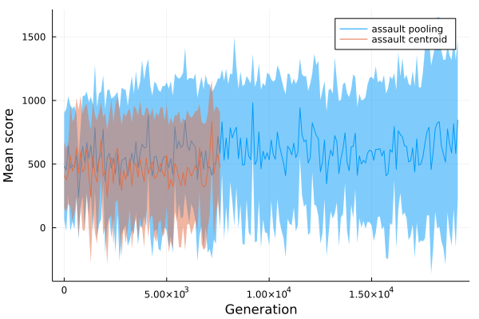
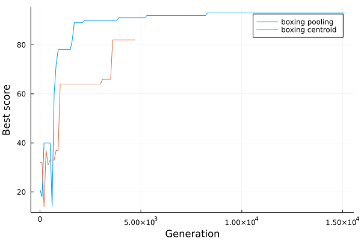
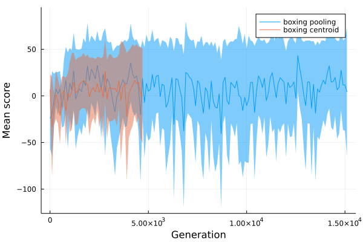

# IICGP

(Interactive) Interpretable Cartesian Genetic Programming

To build and install a Julia binding for [OpenCV](https://github.com/opencv/opencv), we recommend [the following tutorial](https://docs.opencv.org/master/d8/da4/tutorial_julia.html).

## CGP Functions computational costs

CPU used for measurement: Intel(R) Core(TM) i5-7440HQ CPU @ 2.80GHz

Scalar functions:

| Function | @btime |
|---|---|
| f_add |   73.729 ns (4 allocations: 64 bytes)
| f_subtract |   72.271 ns (4 allocations: 64 bytes)
| f_mult |   73.489 ns (4 allocations: 64 bytes)
| f_div |   76.209 ns (4 allocations: 64 bytes)
| f_abs |   71.767 ns (4 allocations: 64 bytes)
| f_sqrt |   73.844 ns (4 allocations: 64 bytes)
| f_pow |   169.109 ns (4 allocations: 64 bytes)
| f_exp |   80.602 ns (4 allocations: 64 bytes)
| f_sin |   73.807 ns (4 allocations: 64 bytes)
| f_cos |   77.198 ns (4 allocations: 64 bytes)
| f_tanh |   75.054 ns (4 allocations: 64 bytes)
| f_sqrt_xy |   72.361 ns (4 allocations: 64 bytes)
| f_lt |   72.076 ns (4 allocations: 64 bytes)
| f_gt |   71.393 ns (4 allocations: 64 bytes)
| f_and |   73.774 ns (4 allocations: 64 bytes)
| f_or |   75.554 ns (4 allocations: 64 bytes)
| f_xor |   77.220 ns (4 allocations: 64 bytes)
| f_not |   71.539 ns (4 allocations: 64 bytes)

Image functions on full size image (160x210 = 33600 pixels):

| Function | @btime |
|---|---|
| f_dilate |   129.781 μs (9 allocations: 65.88 KiB)
| f_erode |   129.623 μs (9 allocations: 65.88 KiB)
| f_subtract |   18.095 μs (3 allocations: 65.78 KiB)
| f_remove_details |   521.964 μs (33 allocations: 263.45 KiB)
| f_make_boxes |   2.521 ms (5896 allocations: 2.87 MiB)
| f_felzenszwalb_segmentation |   20.024 ms (136549 allocations: 15.51 MiB)
| f_components_segmentation |   990.960 μs (71 allocations: 1.74 MiB)
| f_box_segmentation |   2.224 ms (784 allocations: 3.24 MiB)
| f_threshold |   114.592 μs (10 allocations: 546.36 KiB)
| f_binary |   152.759 μs (17 allocations: 616.38 KiB)
| f_corners |   1.769 ms (14 allocations: 1.17 MiB)
| f_gaussian |   942.508 μs (128 allocations: 1.70 MiB)
| f_laplacian |   580.035 μs (31 allocations: 1.35 MiB)
| f_sobel_x |   557.711 μs (114 allocations: 1.68 MiB)
| f_sobel_y |   539.037 μs (114 allocations: 1.68 MiB)
| f_canny |   6.954 ms (567 allocations: 8.05 MiB)
| f_edges |   1.434 ms (197 allocations: 3.80 MiB)
| f_opening |   253.334 μs (15 allocations: 65.97 KiB)
| f_closing |   253.296 μs (15 allocations: 65.97 KiB)
| f_tophat |   272.295 μs (17 allocations: 131.73 KiB)
| f_bothat |   272.230 μs (17 allocations: 131.73 KiB)
| f_morphogradient |   277.672 μs (19 allocations: 197.50 KiB)
| f_morpholaplace |   594.862 μs (29 allocations: 2.31 MiB)
| f_bitwise_not |   13.469 μs (3 allocations: 65.78 KiB)
| f_bitwise_and |   18.322 μs (3 allocations: 65.78 KiB)
| f_bitwise_or |   18.547 μs (3 allocations: 65.78 KiB)
| f_bitwise_xor |   18.309 μs (3 allocations: 65.78 KiB)
| f_motion_capture |   179.721 μs (9 allocations: 197.41 KiB)
| f_motion_distances |   3.327 ms (66773 allocations: 3.48 MiB)

Image functions on halved-size image (80x105 = 8400 pixels):

| Function | @btime |
|---|---|
| f_threshold |   19.376 μs (8 allocations: 79.16 KiB)
| f_subtract |   5.704 μs (1 allocation: 8.38 KiB)
| f_binary |   25.306 μs (14 allocations: 85.22 KiB)
| f_erode |   17.323 μs (7 allocations: 8.47 KiB)
| f_dilate |   17.316 μs (7 allocations: 8.47 KiB)
| f_bitwise_not |   4.199 μs (1 allocation: 8.38 KiB)
| f_bitwise_and |   5.803 μs (1 allocation: 8.38 KiB)
| f_bitwise_or |   5.653 μs (1 allocation: 8.38 KiB)
| f_bitwise_xor |   6.126 μs (1 allocation: 8.38 KiB)
| f_motion_capture |   25.473 μs (5 allocations: 25.22 KiB)

# Features extraction

|Mean-pooling|Centroid|
|---|---|
|||

# TODOs

High priority to low priority:

- Fix determinism issues (see results from 2021-08-24)
- Fix slow down issue in experiment from 2021-08-24
- Speed-up centroid reducer's reducing function
- Allow bootstrap of both encoder and controller
- An R^2 controller reasonning about centroids directly?

# Reducing experiments length

### Speed-up evolution

- Less frames for evaluation (curently 10000)
- Sticky actions, less forward passes in evaluation
- Add preliminary tests to Atari evaluation, e.g.:
	- forward-pass < 1ms
	- Assert that the encoder only applies a limited number of filters before one output
	- evaluate the quality of the produced feature vector:
		- measure the amount of information and compare to input image (proxy to entropy measure?)
		- reconstruction error (without backward pass?)

### Speed-up forward-pass
	
- Lower the number of input (e.g. centroid reduction may be as usefull applied on 1 grayscale image as on 3 RGB images)
- Encoder: max-out number of filters applied sequentially (if we assume our filters are well chosen, few would be enough)
- Downscale all input images (max-pool dividing the image size by 2)
- Low-cost image filters (threshold, binary, subtract, erode, dilate, not, and, or, xor)

# Results

2021-08-11:
- Reducer + controller (no encoder)
- 3 RGB images

|Best score|Mean score|
|---|---|
|||
|||
|||

2021-08-24:
- Encoder + Reducer + controller
- Downscale
- Grayscale

|Best score|Mean score|
|---|---|
|||
|||

