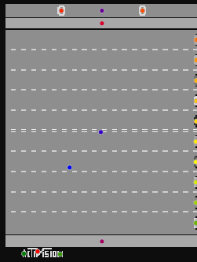

# IICGP

(Interactive) Interpretable Cartesian Genetic Programming

To build and install a Julia binding for [OpenCV](https://github.com/opencv/opencv), we recommend [the following tutorial](https://docs.opencv.org/master/d8/da4/tutorial_julia.html).

## CGP Functions

Scalar functions:

| Function | Time (μs) | Allocations | MTCGP |
|---|---|---|---|
| f_add | 0.11 | 5 allocations: 160  bytes | ✔ |
| f_subtract | 0.12 | 5 allocations: 160  bytes | ✔ |
| f_mult | 0.12 | 5 allocations: 160  bytes | ✔ |
| f_div | 0.11 | 5 allocations: 160  bytes | ✘ |
| f_abs | 0.11 | 5 allocations: 160  bytes | ✔ |
| f_sqrt | 0.11 | 5 allocations: 160  bytes | ✔ |
| f_pow | 0.18 | 5 allocations: 160  bytes | ✔ |
| f_exp | 0.14 | 5 allocations: 160  bytes | ✔ |
| f_sin | 0.12 | 5 allocations: 160  bytes | ✔ |
| f_cos | 0.12 | 5 allocations: 160  bytes | ✘ |
| f_tanh | 0.15 | 5 allocations: 160  bytes | ✘ |
| f_sqrt_xy | 0.11 | 5 allocations: 160  bytes | ✔ |
| f_lt | 0.11 | 5 allocations: 160  bytes | ✔ |
| f_gt | 0.12 | 5 allocations: 160  bytes | ✔ |
| f_and | 0.12 | 5 allocations: 160  bytes | ? |
| f_or | 0.12 | 5 allocations: 160  bytes | ? |
| f_xor | 0.12 | 5 allocations: 160  bytes | ? |
| f_not | 0.11 | 5 allocations: 160  bytes | ? |

Image functions:

| Function | Time (μs) | Allocations | MTCGP |
|---|---|---|---|
| f_dilate | 157.02 | 10 allocations: 65.97 KiB | ✘ |
| f_erode | 156.05 | 10 allocations: 65.97 KiB | ✘ |
| f_subtract | 18.54 | 4 allocations: 65.88 KiB | ✘ |
| f_remove_details | 626.3 | 34 allocations: 263.55 KiB | ✘ |
| f_make_boxes | 2872 | 6964 allocations: 2.90 MiB | ✘ |
| f_felzenszwalb_segmentation | 24947 | 137476 allocations: 15.52 MiB | ✘ |
| f_components_segmentation | 1267 | 80 allocations: 1.75 MiB | ✘ |
| f_box_segmentation | 2760 | 920 allocations: 3.24 MiB | ✘ |
| f_threshold | 128.16 | 11 allocations: 546.45 KiB | ✘ |
| f_binary | 180.35 | 18 allocations: 616.47 KiB | ✘ |
| f_corners | 2125 | 15 allocations: 1.17 MiB | ✘ |
| f_gaussian | 1387 | 130 allocations: 1.68 MiB | ✘ |
| f_laplacian | 669.39 | 38 allocations: 1.35 MiB | ✘ |
| f_sobel_x | 741.48 | 120 allocations: 1.65 MiB | ✘ |
| f_sobel_y | 741.83 | 120 allocations: 1.65 MiB | ✘ |
| f_canny | 8932 | 555 allocations: 8.00 MiB | ✘ |
| f_edges | 1792 | 182 allocations: 3.75 MiB | ✘ |
| f_opening | 307.5 | 16 allocations: 66.06 KiB | ✘ |
| f_closing | 307.44 | 16 allocations: 66.06 KiB | ✘ |
| f_tophat | 329.34 | 18 allocations: 131.83 KiB | ✘ |
| f_bothat | 329.28 | 18 allocations: 131.83 KiB | ✘ |
| f_morphogradient | 334.75 | 20 allocations: 197.59 KiB | ✘ |
| f_morpholaplace | 753.98 | 30 allocations: 2.31 MiB | ✘ |
| f_bitwise_not | 20.91 | 4 allocations: 65.88 KiB | ✘ |
| f_bitwise_and | 20.46 | 4 allocations: 65.88 KiB | ✘ |
| f_bitwise_or | 20.67 | 4 allocations: 65.88 KiB | ✘ |
| f_bitwise_xor | 22.86 | 4 allocations: 65.88 KiB | ✘ |
| f_motion_capture | 251.47 | 9 allocations: 197.41 KiB | ✘ |
| f_motion_distances | 3910 | 66781 allocations: 3.48 MiB | ✘ |

# Features extraction

# TODOs

From high priority to low priority:

- Speed-up centroid reducer's reducing function
- Allow bootstrap of both encoder and controller
- An R^2 controller reasonning about centroids directly?

# Reducing run length

### Rule of thumb

If we set:

- time full forward pass of individual = 1ms
- number of generations = 50000
- number of frames in Atari (not including frameskip) = 10000

Then it requires 5 days for completion.

### Speed-up options:

- Reduce evaluation time:
  - Max out the number of filters that can be used in the encoder (e.g. 4 filters in a row for one output should be enough if we consider that those filters are well chosen)
  - reduce `max_frame`
  - sticky actions to go deeper in the game
  - prune some evaluations by adding qualifying tests (an individual can only be evaluated if it satisfies preliminary tests, e.g., amount of information in feature vector / things like reconstruction errors)
  - Lower number of inputs, are RGB always useful compared to gray level?
- Higher `lambda`, lower `n_gen`

